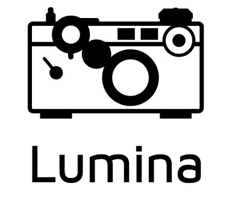

<p align="center">
	
</p>

<p align="center">
    <a href="https://api.travis-ci.org/dokun1/Lumina.svg?branch=master">
        
    </a>
	<a href="https://cocoapods.org/pods/Lumina">
		
	</a>
	<a href="https://github.com/Carthage/Carthage">
		
	</a>
	<a href="https://swift.org/package-manager/">
		
	</a>
	<a href="https://choosealicense.com/licenses/mit/">
		
	</a>
	<a href="https://github.com/RichardLitt/standard-readme">
		
	</a>
	<a href="https://img.shields.io/cocoapods/p/Lumina.svg?style=flat">
		
	</a>
</p>

----------------

Would you like to use a fully-functional camera in an iOS application in seconds? Would you like to do CoreML image recognition in just a few more seconds on the same camera? Lumina is here to help.

<p align="center">
	<a href="https://www.youtube.com/watch?v=8eEAvcy708s" target="_blank">
		
	</a>
</p>


Cameras are used frequently in iOS applications, and the addition of `CoreML` and `Vision` to iOS 11 has precipitated a rash of applications that perform live object recognition from images - whether from a still image or via a camera feed.

Writing `AVFoundation` code can be fun, if not sometimes interesting. `Lumina` gives you an opportunity to skip having to write `AVFoundation` code, and gives you the tools you need to do anything you need with a camera you've already built.

<p align="center">
	
</p>

Lumina can:

- capture still images
- capture videos
- capture live photos
- capture depth data for still images from dual camera systems
- stream video frames to a delegate
- scan any QR or barcode and output its metadata
- detect the presence of a face and its location
- use any CoreML compatible model to stream object predictions from the camera feed

## Table of Contents

- [Requirements](#requirements)
- [Background](#background)
- [Install](#install)
- [Usage](#usage)
- [Maintainers](#maintainers)
- [Contribute](#contribute)
- [License](#license)

## Requirements

- Xcode 10.0+ (by loading Swift 4 Toolchain)
- iOS 11.0
- Swift 5.0

## Background

[David Okun](https://twitter.com/dokun24) has experience working with image processing, and he thought it would be a nice thing to have a camera module that allows you to stream images, capture photos and videos, and have a module that lets you plug in a CoreML model, and it streams the object predictions back to you alongside the video frames.

## Contribute

See [the contribute file](CONTRIBUTING.md)!

PRs accepted.

Small note: If editing the README, please conform to the [standard-readme](https://github.com/RichardLitt/standard-readme) specification.

## Install

### CocoaPods

You can use [CocoaPods](https://cocoapods.org) to install `Lumina` by adding it to your `Podfile`:

```ruby
platform :ios, '12.0'
use_frameworks!

target 'MyApp' do
    pod 'Lumina'
end
```

### Carthage

You can use [Carthage](https://github.com/Carthage/Carthage) to install `Lumina` by adding it to your `Cartfile`:

```bash
github "dokun1/Lumina"
```

### Swift Package Manager

#### NB: Lumina does not currently build with Swift Package Manager due to a lack of support for frameworks that require UIKit. Nonetheless, as SPM evolves, Lumina will be ready to support it!

You can use [Swift Package Manager](https://swift.org/package-manager/) to install `Lumina` by adding the proper description to your `Package.swift` file:

```swift
import PackageDescription

let package = Package(
    name: "YOUR_PROJECT_NAME",
    targets: [],
    dependencies: [
        .Package(url: "https://github.com/dokun1/Lumina.git", majorVersion: 1)
    ]
)
```

**NB**: As the Swift Package Manager continues to grow, please view its documentation [here](https://swift.org/package-manager/#example-usage).

### Manually

Clone or download this repository, and use the provided workspace to build a version of the library for your own use in any application.

## Usage

**NB**: This repository contains a sample application. This application is designed to demonstrate the entire feature set of the library. We recommend trying this application out.

### Initialization

Consider that the main use of `Lumina` is to present a `ViewController`. Here is an example of what to add inside a boilerplate `ViewController`:

```swift
import Lumina

```

We recommend creating a single instance of the camera in your ViewController as early in your lifecycle as possible with:

```swift
let camera = LuminaViewController()
```

Presenting `Lumina` goes like so:

```swift
present(camera, animated: true, completion:nil)
```

**Remember to add a description for `Privacy - Camera Usage Description` and `Privacy - Microphone Usage Description` in your `Info.plist` file, so that system permissions are handled properly.**

### Logging

Lumina allows you to set a level of logging for actions happening within the module. The logger in use is [HeliumLogger](https://github.com/IBM-Swift/HeliumLogger), made by the [Swift@IBM](https://github.com/IBM-Swift) team. The deeper your level of logging, the more you'll see in your console.

**NB**: While Lumina is licensed by the MIT license, [swift-log](https://github.com/apple/swift-log) is licensed by [Apache 2.0](https://github.com/apple/swift-log/blob/master/LICENSE.txt). A copy of the license is also included in the source code.

To set a level of logging, set the static var on `LuminaViewController` like so:

```swift
LuminaViewController.loggingLevel = .verbose
```

Levels read like so, from least to most logging:

- NONE
- INFO
- NOTICE
- WARNING
- CRITICAL
- ERROR
- DEBUG
- TRACE

### Functionality

There are a number of properties you can set before presenting `Lumina`. You can set them before presentation, or during use, like so:

```swift
camera.position = .front // could also be .back
camera.recordsVideo = true // if this is set, streamFrames and streamingModel are invalid
camera.streamFrames = true // could also be false
camera.textPrompt = "This is how to test the text prompt view" // assigning an empty string will make the view fade away
camera.trackMetadata = true // could also be false
camera.resolution = .highest // follows an enum
camera.captureLivePhotos = true // for this to work, .resolution must be set to .photo
camera.captureDepthData = true // for this to work, .resolution must be set to .photo, .medium1280x720, or .vga640x480
camera.streamDepthData = true // for this to work, .resolution must be set to .photo, .medium1280x720, or .vga640x480
camera.frameRate = 60 // can be any number, defaults to 30 if selection cannot be loaded
camera.maxZoomScale = 5.0 // not setting this defaults to the highest zoom scale for any given camera device
```

### Object Recognition

**NB:** This only works for iOS 11.0 and up.

You must have a `CoreML` compatible model(s) to try this. Ensure that you drag the model file(s) into your project file, and add it to your current application target.

The sample in this repository comes with the `MobileNet` and `SqueezeNet` image recognition models, but again, any `CoreML` compatible model will work with this framework. Assign your model(s) to the framework using the convenient class called `LuminaModel` like so:

```swift
camera.streamingModels = [LuminaModel(model: MobileNet().model, type: "MobileNet"), LuminaModel(model: SqueezeNet().model, type: "SqueezeNet")]
```

You are now set up to perform live video object recognition.

### Handling output

To handle any output, such as still images, video frames, or scanned metadata, you will need to make your controller adhere to `LuminaDelegate` and assign it like so:

```swift
camera.delegate = self
```

Because the functionality of the camera can be updated at runtime, all delegate functions are required.

To handle the `Cancel` button being pushed, which is likely used to dismiss the camera in most use cases, implement:

```swift
func dismissed(controller: LuminaViewController) {
    // here you can call controller.dismiss(animated: true, completion:nil)
}
```

To handle a still image being captured with the photo shutter button, implement:

```swift
func captured(stillImage: UIImage, livePhotoAt: URL?, depthData: Any?, from controller: LuminaViewController) {
        controller.dismiss(animated: true) {
    // still images always come back through this function, but live photos and depth data are returned here as well for a given still image
    // depth data must be manually cast to AVDepthData, as AVDepthData is only available in iOS 11.0 or higher.
}
```

To handle a video being captured with the photo shutter button being held down, implement:

```swift
func captured(videoAt: URL, from controller: LuminaViewController) {
    // here you can load the video file from the URL, which is located in NSTemporaryDirectory()
}
```

**NB**: It's import to note that, if you are in video recording mode with Lumina, streaming frames is not possible. In order to enable frame streaming, you must set `.recordsVideo` to false, and `.streamFrames` to true.

To handle a video frame being streamed from the camera, implement:

```swift
func streamed(videoFrame: UIImage, from controller: LuminaViewController) {
    // here you can take the image called videoFrame and handle it however you'd like
}
```

To handle depth data being streamed from the camera on iOS 11.0 or higher, implement:
```swift
func streamed(depthData: Any, from controller: LuminaViewController) {
    // here you can take the depth data and handle it however you'd like
    // NB: you must cast the object to AVDepthData manually. It is returned as Any to maintain backwards compatibility with iOS 10.0
}
```

To handle metadata being detected and streamed from the camera, implement: 

```swift
func detected(metadata: [Any], from controller: LuminaViewController) {
    // here you can take the metadata and handle it however you'd like
    // you must find the right kind of data to downcast from, whether it is of a barcode, qr code, or face detection
}
```

To handle the user tapping the screen (outside of a button), implement:

```swift
func tapped(from controller: LuminaViewController, at: CGPoint) {
    // here you can take the position of the tap and handle it however you'd like
    // default behavior for a tap is to focus on tapped point
}
```

To handle a `CoreML` model and its predictions being streamed with each video frame, implement:
```swift
func streamed(videoFrame: UIImage, with predictions: [LuminaRecognitionResult]?, from controller: LuminaViewController) {
    if #available(iOS 11.0, *) {
        guard let predicted = predictions else {
            return
        }
        var resultString = String()
        for prediction in predicted {
            guard let values = prediction.predictions else {
                continue
            }
            guard let bestPrediction = values.first else {
                continue
            }
            resultString.append("\(String(describing: prediction.type)): \(bestPrediction.name)" + "\r\n")
        }
        controller.textPrompt = resultString
    } else {
        print("CoreML not available in iOS 10.0")
    }
}
```

Note that this returns a class type representation associated with the detected results. The example above also makes use of the built-in text prompt mechanism for Lumina.

### Changing the user interface

To adapt the user interface to your needs, you can set the visibility of the buttons by calling these methods on `LuminaViewController`:

```swift
camera.setCancelButton(visible: Bool)
camera.setShutterButton(visible: Bool)
camera.setSwitchButton(visible: Bool)
camera.setTorchButton(visible: Bool)
```

Per default, all of the buttons are visible.

## Maintainers

- David Okun [](https://twitter.com/dokun24) [](https://github.com/dokun1) 
- Richard Littauer [](https://twitter.com/richlitt) [](https://github.com/RichardLitt)
- Daniel Conde [](https://twitter.com/danielconde7) [](https://github.com/dconde7)
- Zach Falgout [](https://twitter.com/ZFalgout1) [](https://github.com/ZFalgout)  
- Gerriet Backer [](https://twitter.com/gerriet) [](https://github.com/gerriet)
- Greg Heo [](https://twitter.com/gregheo) [](https://github.com/gregheo)

## License

[MIT](LICENSE) © 2019 David Okun
